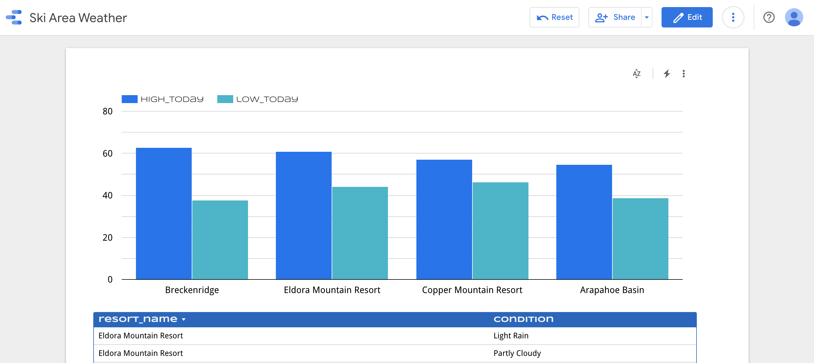
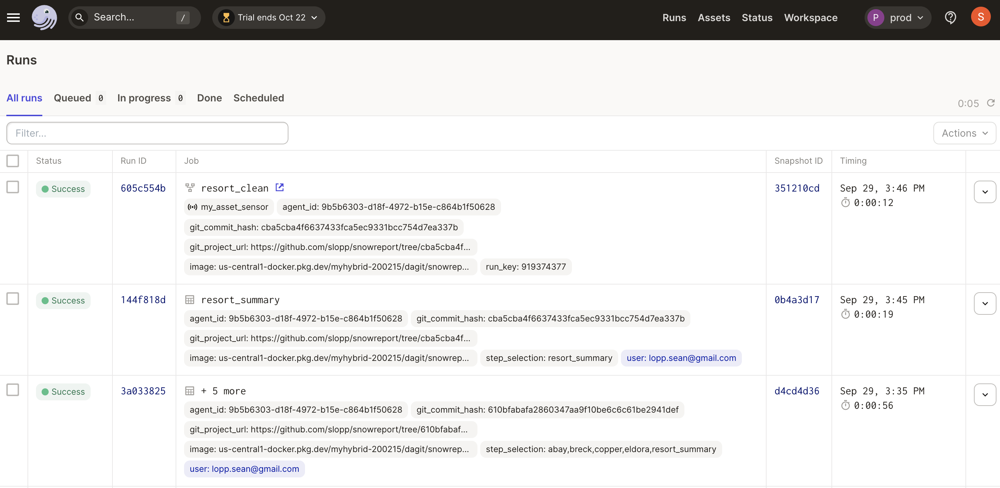
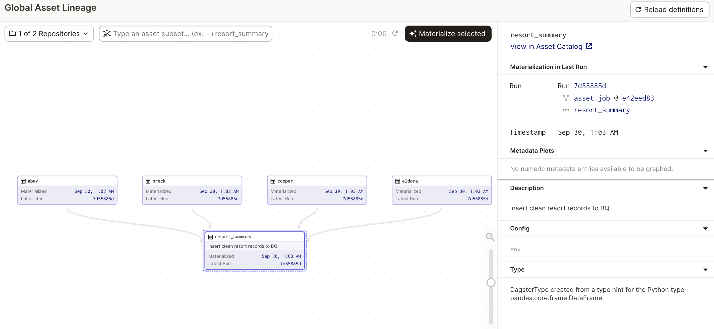
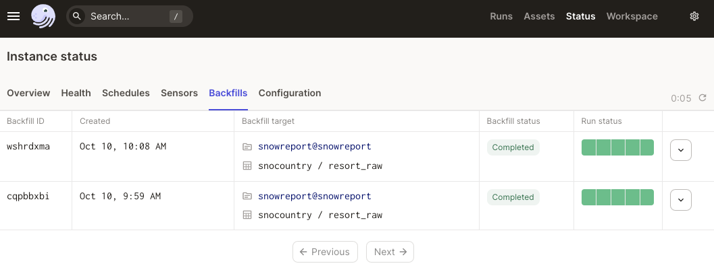
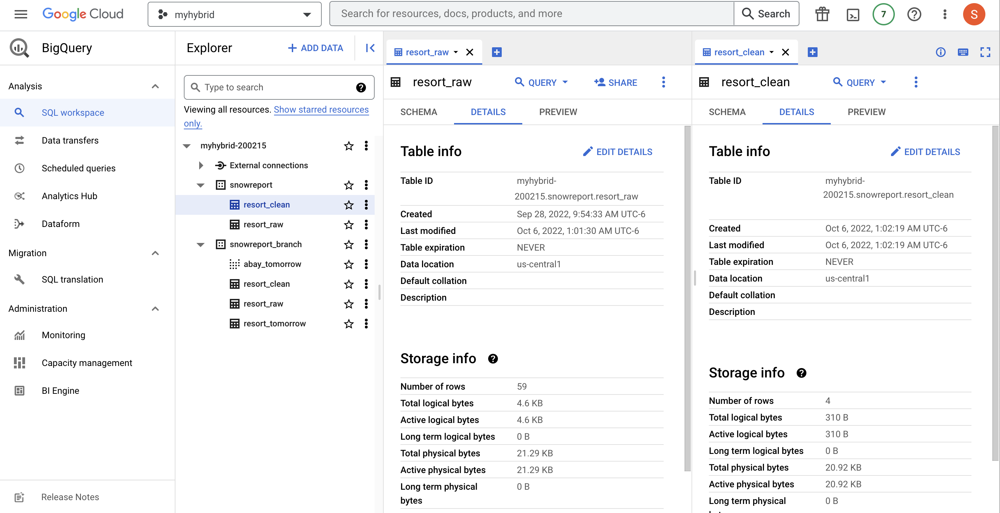

# snowreport

I live in the front range of Colorado, which means each ski weekend I have to make the difficult choice about which world class resort to visit. To aide in this choice, over the years, I've built data pipelines and dashboards to show an aggregated view of resort conditions like weather, terrain status, and snow conditions. These data products make it easy to compare resorts with a single web visit instead of visiting the website for each resort.

This repository contains a dagster implementation. For each ski resort, an API request is made that returns weather, terrain status, snow conditions, and other resort details. The results of the requests are then stored in BigQuery, prepared for visualization, and presented in a dashboard.

*Disclosure, I now work at Elementl, the makers of dagster. This [post](https://loppsided.blog/posts/2022-10-07-from-the-behemoth/) explains why I left Google Cloud, but this project cemented my enthusiasm for the product*.



Report result: https://datastudio.google.com/reporting/136a93b3-8070-410a-a884-f0f657307d12

I've built this same pipeline in [R](https://github.com/slopp/scheduledsnow) and [GCP](https://github.com/slopp/embed-snow). This time is a little different, but kind of the same.



## Project Evolution 

One reason I keep re-building these data products is that I learn new tools best when I have a clear goal of what I want to build. Re-implementing the same patterns in new stacks also allows me to compare and contrast technologies:

- The R version relied on local storage, and production was scheduled on RStudio Connect and used a "production" volume mounted to the server. One scheduled function pulled all the data. A second scheduled function cleaned the data and generated a report. The two schedules were not connected, just run a half hour apart.   

- The second version of the project used all the GCP services. A scheduled Cloud Function would pull the data for all resorts and write it to GCS. Then a constantly running ($$$) Dataflow job would read the GCS data and write it to BigQuery. Looker did most of the clean up and surfaced the resulting dashboard in a website using an iframe embed.  

- This version uses dagster! A few of the key benefits are:  
    - There is now a separation between the production pipeline, my local testing, and a staging pipeline that runs on PRs to the code. This is the first version of the project tightly coupled with version control.  

    - The different environments use the same logic, but different resources. The local pipeline runs with just pandas dataframes that are stored on disk. The staging pipeline writes the resort data to GCS and then loads and cleans it in BigQuery, within a staging dataset (schema). The production pipeline is the same as the staginging pipeline, but uses the production dataset (schema).  

    - The dagster version of the project correctly reflects the dependency between the resort data and the final summary tables. Each resort data pull is an independent step instead of all the resort data being pulled in one function with a for-loop. This separation makes it easy to re-run one resort if the API call fails. The resort summary can be updated with the new resort data while using cached results for the other resorts. 

    - The dagster version support backfills. The raw resort data is stored in GCS each day. If I want to change the loading logic for my table that loads the resort data, dagster makes it easy to go back through the historical stored data and load it using the new logic.

    - This version uses DataStudio for the report visualization. As you can tell, my interest in the reporting layer has decreased over time while my interest in the backend pipeline has increased. :shrug:. The report probably looks the best in DataStudio anyway which is a testament to how cruddy I am at CSS regardless of the platform or level of interest.

All in all, this version of the project definitely required the most investment, but it also feels the most robust. In refactoring the code I caught mistakes in my staging environment that would have just trashed my other "production" versions of the project.


## Why Dagster

I could have used Airflow, but opted to use Dagster because:

### Dataset Aware

Dagster is aware that my goal is to create datasets. This awareness makes it possible for me to "re-materialize" specific assets (like data from one resort) and to see asset lineage. In comparison, other schedulers just execute tasks and lack the rich metadata and handy interface that is aware of the results.  



Partitions and backfills are also possible because dagster is aware I am building datasets. If I update my asset logic, I can re-run the tasks to build the new asset with historical "upstream" data in a backfill, instead of manually managing tons of backfill logic in my code.




### Code Structure and Local Development

Because Dagster knows that I'm building datasets, it has strong opinions about how to structure my code. The data processing logic is separate from the data storage logic. This separation made it easy for me to have local development build on pandas with staging and production built on GCS and BigQuery. The core logic was the same, see `assets`, and the different storage for local/staging/prod was handled by `resources`. While you can fuss around with `if` statements to achieve similar outcomes in other tools, the first class support in Dagster makes a world of difference.

Speaking of local development, in dagster I developed everything locally with Python. I didn't have to mess with Docker or minikube. In other schedulers I would have done the initial development with cloud resources, which dramatically slows things down (see v2 of this project). I get really distracted if I have to wait for Kubernetes schedulers to test a code change!

 Once my dagster code was ready I did have to setup my production deployment, which took some Kubernetes iterations. However, those iterations were config iterations not code changes - a one-time setup cost for the project. Now that production and staging are configured, I can make changes to my core code locally without ever waiting on the Kubernetes setup.

 The code structure also makes it possible to do unit tests that use mock resources.

### Internal Architecture

Airflow workers load all the code all the time. This architecture can create performance issues, but it also causes a dependency nightmare where the data transformation python code has to be compatible with airflow's internal dependencies. The natural workaround to these two problems is to create distinct Airflow clusters for everything, which sort of defeats the point of a scheduler knowing about the dependencies between things!

Dagster's built differently and ensures that the Dagster control plane is separate from my user code. For a toy project like this one the impact is mostly hypothetical, but for actual workloads these architecture hurdles a big deal.

## About the Environment

This project is using Dagster Cloud's Hybrid deployment model. Basically:  

1. I wrote my code and ran it locally using just a Python virtual environment. I was also able to test my staging and production resources (GCS and BigQuery) using my local environment by supplying the right GCP IAM permissions to the environment.  

2. Next I setup Dagster Cloud which serves as my control plane. I also setup a GKE autopilot cluster which serves as my execution plane.  

3. I made a few modifications to prepare it for deployment. I added a Dockerfile and dagster deployment configs. I also setup a Google Artifact Registry to house the Docker images containing my code. The code runs in GKE while Dagster Cloud keeps track of everything.  


A few things that I did here are worth calling out for future me:



- I wrote a custom `bq_io_manager` to handle writing my results to BQ, and my implementation expects the BQ dataset and table to already exist and be supplied as resource configuration. I wrote my own IO manager because I wanted to be _appending_ data to my raw table everyday and the default asset IO behavior is to overwrite data. However, now that I have partitions in place, it might be possible to use a regular IO manager that loads all partitions from GCS into the BQ table through a backfill(?) I'm not sure. I will need to experiment a bit more in staging tables.

- I wrote an *op* and *job* that use a *resource* - `bq_writer` - to drop and create a table called `resort_clean`. This job is triggered by a *sensor* whenever the `resort_raw` asset is updated. I primarily did this to test out the job and sensor concepts.

- I added a few dbt assets to test out the dagster and dbt integrations. The dbt integration has a few complexities:
    - To tell dbt that it depeneds on dagster you use a dbt source `snowdb/models/sources.yml`. The asset key in dagster must match the dbt source `name + table`, which in turn means the asset key must be `key prefix + asset name`...

    dagster | dbt
    --- | ---
    key prefix | source name
    asset name/key | table

    - I wanted dbt to switch schemas (BQ datasets) for local/branch/prod deployments. I did this with if templating in `snowdb/models/sources.yml`, but it feels like I've repeated myself A LOT between the dbt profile and the dagster resource configs. 

- I decided to make life a little harder for myself to test out a few different ways to handle authenticating to external services. For GCS, I rely on the underlying environment to have access. In production, this underlying access is granted through the Kubernetes service account which, in turns, binds to a GCP IAM service account in a convulted process called workload identity. See the makefile `k8s_iam_for_gcs` for details. For BQ, I went with the explicit approach of supplying the GCP IAM service account credentials directly to the client code. Locally those credentials are passed through environment variables. In production those environment variables are set through K8s secrets, see the make target `k8s_secrets`. 

- My repo is setup to build my Dagster code into a Docker image for each commit to a PR. This is great for testing changes, but if I just want to update this ReadMe I can have GitHub skip those actions by including `[skip ci]` in the commit message.

- There is a Python notebook that includes code to load assets. Changing the environment code chunk changes whether they load from local or production resources. This notebook is a great way to view the contents of the pickled files.

- My development environment for this work was VS Code + a GCP VM. Most of the helpful commands live in the `Makefile`, but:

```
# to get VS Code to talk to the VM
gcloud compute config-ssh
```

## To Update the Resort Raw Table

Everyday the raw asset loaders pull in new data for each resort and store that data in GCS. The raw data is a JSON blob with tons of fields. The logic that loads the data into a raw table in BQ applies a schema. Both assets use Dagster partitions, which means the historical raw data is available and can be re-used if the logic to load that data into the raw table changes. For example, to add a new column from the JSON data into BQ:

1. Update the asset defition for `resort_raw`.  Test as usual in local and staging.
2. Deploy to dagster updates to production.
3. Remove the current "raw" data:

```
TRUNCATE TABLE `myhybrid-200215.snowreport.resort_raw`
```

4. Launch a backfill materialization for `resort_raw` against all paritions of the upstream assets. This will load the historical data in GCS for all days into the `resort_raw` table.

**Note**: this backfill strategy only works for the raw table. Launching backfills for the resort assets will create _incorrect_ data, because Dagster will run the asset code for each historical day but the code is only able to pull resort data for the current day. This limitation is because the Snocountry API does not provide an "AS OF" query parameter. **DO NOT LAUNCH BACKFILLS FOR THE RESORT ASSETS**.

**Corollary Note**: It is possible to add new resorts, but the new resorts will have data only _as of the date they were added to dagster_.

## Future Work

- [ ] ~Add tests~
- [ ] ~Branch deployments~
- [ ] Figure out how to use Dagster partitions
    - [ ] ~add daily partitions to raw table and individual resorts~
    - [ ] fix tests 
    - [ ] update dagster version so `load_asset` in the ipynb works with partitions
    - [ ] ~figure out if I can use backfills to _append_ data to my BQ raw table without such a hacky IO manager, perhaps using the partition key as the `report_date` field~
- [ ] dbt
    - [ ] ~initial dbt setup~
    - [ ] local dbt should use duckdb instead of BQ
    - [ ] asset that is downstream of dbt
- [ ] Once the ski season begins, update the code to show snowfall totals, predictions, and trail status. 
- [ ] Add a resort facts table.
- [ ] Add in dbt for the SQL based transformations.
- [ ] Cost

## Getting Started

After cloning this repo run `pip install .[dev]`. Then run `dagit`. Everything will run in `local` mode which doesn't require any resources or secrets!

To get going with GCS and BQ, modify the `repository.py` resource config as appropriate and ensure you have a `SA_PRIVATE_KEY` and `SA_PRIVATE_KEY_ID` set. `SA` is short for GCP service account. The IAM permissions required for that service account are...well...least privilege would suggest they should be few and far between. I just gave my SA Cloud Storage Admin and BigQuery Admin roles.


